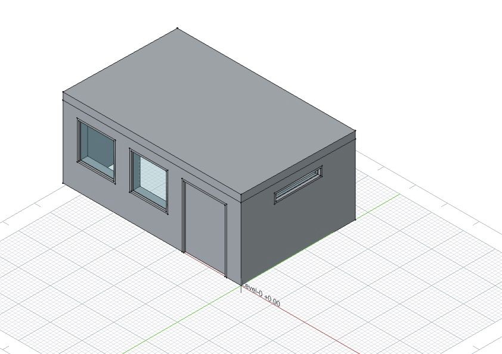
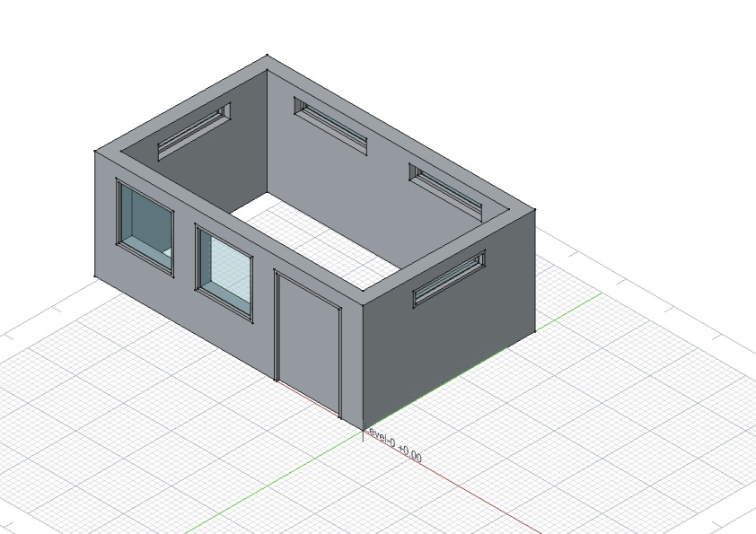
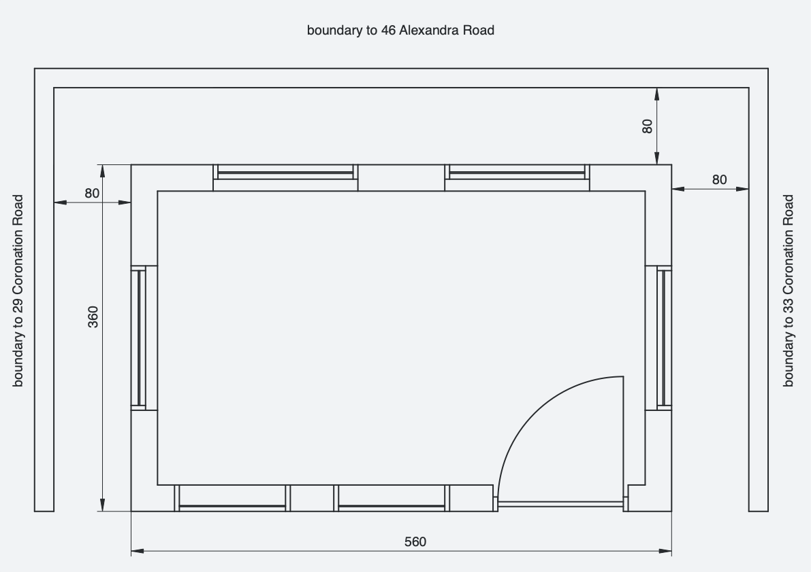
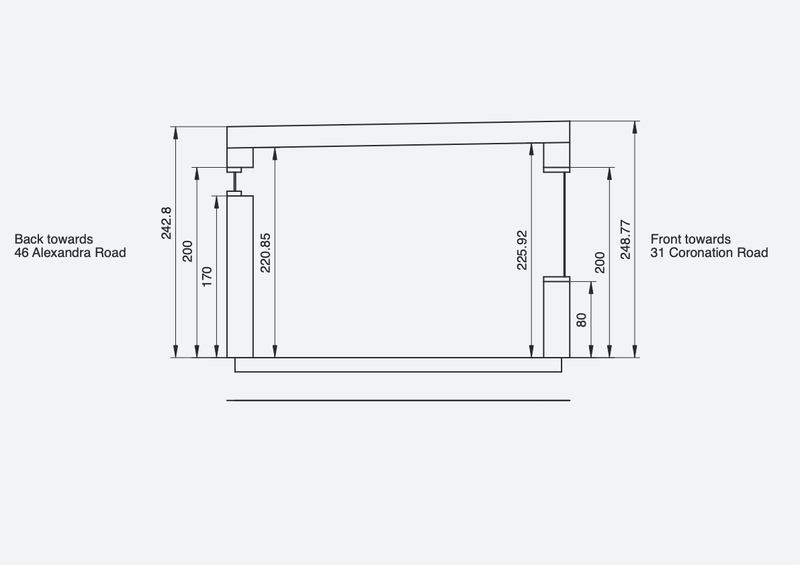

Welcome to the Cowes Garden Room Project documentation site. This site hosts our high-fidelity Standard Operating Procedures (SOPs) for a Passivhaus inspired garden room construction in Cowes, UK.

> ⚠️ **Warning:** This content is still a work in progress and things will change as we go. Should mostly be details though.

## Construction Blueprints

* [**Master Plan**](./plans/MASTER_PLAN.html) - High-Fidelity Technical Specification & Construction SOP
* [**Workplan**](./plans/WORKPLAN.html) - Chronological execution schedule - not highly accurate.

## Architectural Visualizations

### 3D Model

### 3D Model without roof

### Floorplan

### Vertical Cut

---
*Built with [GitHub Pages](https://pages.github.com/).*
